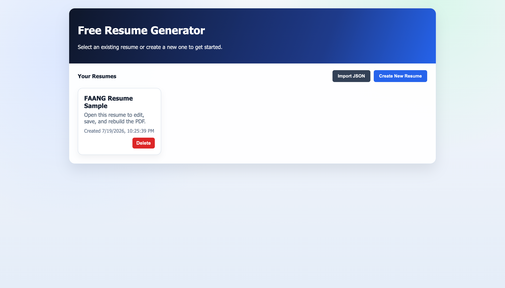
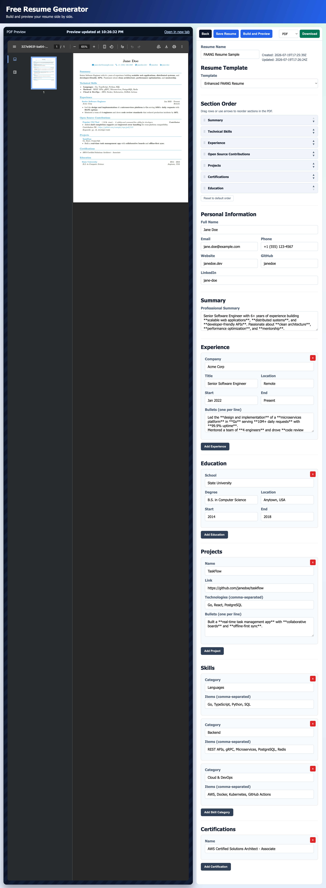

<div align="center">

# 📄 Free Resume Generator

### Create FAANG-grade, ATS-friendly resumes in minutes — 100% free, 100% local.

[](https://www.docker.com/)
[](https://github.com/alidevhere/Free-Resume-Generator/pkgs/container/free-resume-generator)
[](LICENSE)
[](https://go.dev/)
[](https://nextjs.org/)

**A free, open-source resume generator with a live preview editor and one-click PDF export.**
**No sign-ups. No telemetry. No data leaving your machine. Just a polished resume.**

</div>

---

## ✨ Why Free Resume Generator?

Most resume builders lock the good stuff behind paywalls, watermarks, or mandatory accounts. This project flips that model:

- 🎯 **FAANG-grade templates** — LaTeX-based layouts engineered to sail through ATS (Applicant Tracking System) filters.
- 👁️ **Live preview** — Watch your resume take shape in real time as you type.
- 📄 **One-click PDF export** — Pixel-perfect PDFs rendered by the Tectonic LaTeX engine.
- 🗂️ **Multiple resumes** — Tailor a different resume for every job application.
- 🧩 **Reorderable sections** — Rearrange experience, skills, projects, and education however you like.
- 💾 **One-click save** — Save your resume to a local SQLite database with a single click, or export it as JSON.
- 🔒 **Local-first & private** — Your data lives on your machine, never in the cloud.
- 🐳 **Docker-first** — One command to run the entire app. No installers, no dependencies to chase.
- 📶 **Offline PDF generation** — The Tectonic LaTeX cache is pre-warmed at image build time, so PDF export works even with no internet access.

> Built for job seekers who want a professional resume without the subscription tax.

---

## 📸 Screenshots

<table>
  <tr>
    <td width="100%" align="center"><b>Welcome Page</b> — your resume library, where you create, open, or import resumes</td>
  </tr>
  <tr>
    <td width="100%" align="center"></td>
  </tr>
  <tr>
    <td width="100%" align="center"><b>Resume Builder</b> — edit your resume with a live PDF preview side-by-side</td>
  </tr>
  <tr>
    <td width="100%" align="center"></td>
  </tr>
</table>

---

## 🛠️ Tech Stack

| Layer      | Technology                                        |
| ---------- | ------------------------------------------------- |
| Backend    | Go, `net/http`, SQLite (`modernc.org/sqlite`)     |
| Frontend   | Next.js 15, React 19, TypeScript                  |
| PDF Engine | Tectonic (modern, self-contained LaTeX engine)    |
| Packaging  | Docker (multi-arch: `linux/amd64`, `linux/arm64`) |

---

## 📋 Prerequisites

To run Free Resume Generator, all you need is **Docker**. That's it — no Go, Node.js, or LaTeX to install.

| Tool               | Required?   | Why                                                   | Install                                                                     |
| ------------------ | ----------- | ----------------------------------------------------- | --------------------------------------------------------------------------- |
| **Docker Engine**  | ✅ Required | Runs the container image                              | [docs.docker.com/engine/install](https://docs.docker.com/engine/install/)   |
| **Docker Compose** | ⚙️ Optional | Only if you prefer `docker compose` over `docker run` | [docs.docker.com/compose/install](https://docs.docker.com/compose/install/) |

> 💡 **Tip:** Docker Desktop (macOS/Windows) and Docker Engine (Linux) both include Compose out of the box.

Verify your setup before continuing:

```bash
docker --version
docker compose version   # optional
```

---

## 🚀 Quick Start

The image is published to the GitHub Container Registry and supports both `amd64` (Intel/AMD) and `arm64` (Apple Silicon / ARM) machines. The container exposes port **`3000`** — the Next.js frontend serves the UI and proxies API calls to the Go backend running inside the same container.

### Option 1 — Run with `docker run` (fastest)

Pull the prebuilt image and run it with persistent storage in one command (`--pull always` ensures the latest image is fetched before running):

```bash
mkdir -p ./data && docker run -d --name resume-generator --pull always \
  -p 3000:3000 \
  -v "$(pwd)/data:/app/backend/data" \
  --restart unless-stopped \
  ghcr.io/alidevhere/free-resume-generator:latest
```

Then open **[http://localhost:3000](http://localhost:3000)** in your browser. 🎉

The SQLite database will be created at `./data/resumes.db` on your host and persists across container restarts.

### Option 2 — Run with Docker Compose

```bash
# Clone the repository
git clone https://github.com/alidevhere/Free-Resume-Generator.git
cd Free-Resume-Generator

# Start the stack (frontend on :3000, backend on internal :8080)
docker compose up -d
```

Then open **[http://localhost:3000](http://localhost:3000)** in your browser. 🎉

### Managing the container

```bash
# View logs
docker logs -f resume-generator

# Stop the app
docker stop resume-generator

# Start it again (data is preserved in the volume)
docker start resume-generator

# Update to the latest image
docker pull ghcr.io/alidevhere/free-resume-generator:latest
docker rm -f resume-generator
# …then re-run the `docker run` command above

# Remove everything (including saved resumes)
docker rm -f resume-generator
rm -rf ./data
```

---

## ⚙️ Configuration

The container is configurable via environment variables. All values are optional.

| Variable          | Default                 | Description                                                          |
| ----------------- | ----------------------- | -------------------------------------------------------------------- |
| `FRONTEND_PORT`   | `3000`                  | Port the Next.js frontend listens on (this is the port you expose).  |
| `BACKEND_PORT`    | `:8080`                 | Port the internal Go backend API listens on (rarely needs changing). |
| `BACKEND_API_URL` | `http://127.0.0.1:8080` | URL the frontend uses to reach the backend (used at build time).     |

### Run on a custom host port

The simplest way to use a different host port is to change the `-p` mapping — no env var changes needed:

```bash
docker run -d \
  --name resume-generator \
  -p 8080:3000 \
  -v "$(pwd)/data:/app/backend/data" \
  --restart unless-stopped \
  ghcr.io/alidevhere/free-resume-generator:latest
```

Then visit **[http://localhost:8080](http://localhost:8080)**.

---

## 💾 Data Persistence

Your resumes are stored in a **SQLite database** at `/app/backend/data/resumes.db` inside the container. To keep them across restarts and updates, **always mount a volume**:

```bash
-v "$(pwd)/data:/app/backend/data"
```

- The database file (`resumes.db`) is created automatically on first run.
- To back up your resumes, simply copy the `./data` directory (or the volume) to a safe location.
- To reset everything, stop the container and delete the `./data` directory.

---

## 🧱 Project Structure

```
Free-Resume-Generator/
├── backend/               # Go backend (API + LaTeX PDF rendering)
│   ├── main.go            # CLI + HTTP server entry point
│   ├── api.go             # REST API handlers
│   ├── db.go              # SQLite-backed resume store
│   ├── resume.json        # Seed/default resume
│   └── templates/         # LaTeX templates
│       └── enhanced-faang-resume.tex.tmpl
├── frontend/              # Next.js frontend
│   ├── app/               # App router pages (library + editor)
│   ├── components/        # React components (editor, UI, library)
│   ├── lib/               # Types, API client, defaults, formatting
│   └── next.config.mjs    # Proxies /api/* to the backend
├── Dockerfile             # Multi-stage build (Go + Next.js + Tectonic)
├── docker-compose.yml     # Docker Compose configuration
├── docker-entrypoint.sh   # Starts backend + frontend in one container
├── media/                 # Screenshots used in this README
└── README.md
```

---

## 🧑‍💻 For Developers (Run from Source)

<details>
<summary>🔧 Local development setup</summary>

#### Prerequisites

- **Go** 1.25+
- **Node.js** 20+
- **Tectonic** (LaTeX engine) — for PDF export ([tectonic-typesetting.github.io](https://tectonic-typesetting.github.io/))

#### Steps

1. **Start the backend** (serves the API on `:8080`):

   ```bash
   cd backend
   go run . -server :8080
   ```

2. **Start the frontend** (in a separate terminal):

   ```bash
   cd frontend
   npm install
   npm run dev
   ```

3. Open **[http://localhost:3000](http://localhost:3000)** for the frontend.
4. The frontend proxies `/api/*` requests to the backend automatically (see `next.config.mjs`).

#### Backend CLI (one-off generation)

You can also generate a resume directly from a JSON file without running the server:

```bash
cd backend
go run . -input resume.json -output output -format latex   # LaTeX only
go run . -input resume.json -output output -format pdf     # PDF only
go run . -input resume.json -output output -format both     # LaTeX + PDF
```

</details>

---

## 📦 Docker Image

The image is built automatically by GitHub Actions (`.github/workflows/docker-publish.yml`) and published to the GitHub Container Registry:

```
ghcr.io/alidevhere/free-resume-generator:latest
```

- **Supported architectures:** `linux/amd64`, `linux/arm64`
- **Tags:** `latest` (on every push to `main`), plus the short commit SHA and branch name.
- **Source:** [github.com/alidevhere/Free-Resume-Generator](https://github.com/alidevhere/Free-Resume-Generator)

### Build the image locally

If you'd rather build from source instead of pulling the prebuilt image:

```bash
docker build -t free-resume-generator .
docker run --rm -p 3000:3000 -v "$(pwd)/data:/app/backend/data" free-resume-generator
```

### Backend-only image

If you only need the API server (no frontend):

```bash
docker build -t resume-generator-backend ./backend
docker run --rm -p 8080:8080 resume-generator-backend
```

---

## 📡 API Reference

The backend exposes a small REST API (proxied through the frontend on `/api/*` when running the combined image):

| Method   | Endpoint            | Description                  |
| -------- | ------------------- | ---------------------------- |
| `GET`    | `/api/resumes`      | List all saved resumes       |
| `POST`   | `/api/resumes`      | Create a new resume          |
| `GET`    | `/api/resumes/{id}` | Get a specific resume        |
| `PUT`    | `/api/resumes/{id}` | Update a specific resume     |
| `DELETE` | `/api/resumes/{id}` | Delete a specific resume     |
| `POST`   | `/api/resume/latex` | Generate LaTeX from a resume |
| `POST`   | `/api/resume/pdf`   | Generate a PDF from a resume |
| `GET`    | `/health`           | Health check                 |

---

## 🤝 Contributing

Contributions are welcome! Whether it's a new template, a bug fix, or a feature idea:

1. Fork the repository.
2. Create a feature branch: `git checkout -b feature/my-awesome-template`.
3. Commit your changes.
4. Open a Pull Request.

Please keep PRs focused and include a clear description of what and why.

---

## 📄 License

This project is licensed under the **MIT License** — free to use, modify, and distribute.

---

<div align="center">

**Made with ❤️ for job seekers everywhere.**

⭐ Star this repo if it helped you land your next role!

</div>
